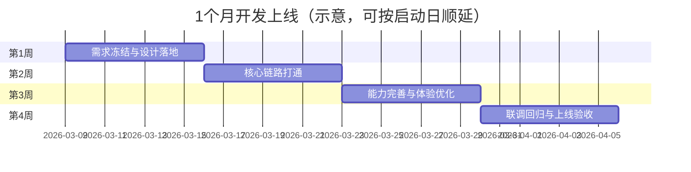

# 问股AI — 功能清单与报价单

本文档说明小程序（问股AI）与 Web 管理端的完整功能清单，以及项目报价、人员配置与开发周期。总报价为 **20 万元（人民币）**。

---

## 一、小程序端功能清单（问股AI）

|分类|功能点|说明|
|------|--------|------|
|**首页**|问候、今日热点、快捷入口、对话历史入口|基于第三方 API 获取财经热点|
|**AI 对话**|通用对话、预设提示（大势/选股/行业等）、流式输出、多模型（千问/DeepSeek）|不依赖研报的独立对话能力|
|**研报导入**|PDF 上传、文本粘贴|调用后端 parse API，支持异步解析|
|**研报摘要**|一页纸摘要展示|6 维度结构化展示（评级、目标价、核心逻辑等）|
|**研报对话**|单研报 RAG 对话、预设问题|基于 reportId，回答源自研报|
|**我的研报**|用户研报列表|含解析状态、入口到摘要与对话|
|**研报浏览**|只读列表、搜索（公司/行业）、6 维度详情|不包含编辑/删除，仅供浏览|
|**设置**|模型切换、暗黑模式|本地配置持久化|
|**历史**|对话历史本地存储、清空|按会话管理，本地缓存|

---

## 二、Web 管理端功能清单（研报管理）

|分类|功能点|说明|
|------|--------|------|
|**认证**|JWT 登录、密码修改|支持超管与普通用户角色|
|**Dashboard**|研报总数、已分析数、平均评分、本月新增、最近研报|基于 stats API 统计展示|
|**研报管理**|PDF/文本上传、列表、行内编辑标题、单删/批量删除、解析状态|完整 CRUD 与 batch-delete|
|**深度分析**|6 维度分析、ECharts 图表、Monaco JSON 编辑、表格行内编辑、保存回写|ChartRenderer、EditableTable、分析结果回写|
|**搜索**|关键词、状态、评分、分页、服务端搜索|/api/reports 多条件查询|
|**用户管理**|超管：用户 CRUD、角色、启用/禁用|/api/users，仅超管可见|

---

## 三、后端与共享能力

|分类|功能点|说明|
|------|--------|------|
|**PDF 解析**|双通道（pdf-parse + Qwen-VL）、异步解析、结构化内容|visionService + synthesizer，表格与图表识别|
|**RAG**|类型感知分块（text/table/chart）、多研报联合检索、Embedding|chunker + vectorStore，多研报对话|
|**API**|解析、摘要、深度分析、对话、CRUD、批量删除、状态轮询、搜索、统计|完整 REST API，见 server/README.md|
|**认证与用户**|JWT、登录、刷新、改密、超管用户管理|角色权限控制|

---

## 四、报价明细

### 4.1 人员与月薪（本项目 1 个月）

本项目按 **6 人 × 1 个月** 计算，总人力支出 **200,000 元**（即本报价总价）。各角色月薪拆分如下：

|角色|人数|月薪（元）|主要产出|
|------|------|------------|----------|
|架构设计师|1|40,000|总体架构/模块划分、关键技术方案、接口规范、性能与稳定性方案、上线评审|
|前端工程师（小程序+Web）|1|35,000|小程序端页面与交互、Web 管理端页面与交互、状态管理与接口联调|
|后端/AI 工程师|1|40,000|后端 API、研报解析管线、摘要/深度分析/对话能力、权限与用户体系|
|RAG 知识库工程师|1|35,000|分块策略与向量索引、检索质量优化、多研报联合检索、离线/增量索引与回归评估|
|UI 设计师|1|25,000|信息架构、关键页面 UI、组件规范、交互动效标注、切图/样式规范|
|测试工程师|1|25,000|测试用例、冒烟/回归、关键链路验收、上线前质量门禁与问题追踪|
|**合计**|**6**|**200,000**|**1 个月交付上线**|

### 4.2 报价包含与不包含

|项目|是否包含|说明|
|------|----------|------|
|需求梳理与技术方案|包含|按既定功能清单范围内，给出可落地方案与排期|
|小程序端开发与联调|包含|含对话、研报导入/摘要/对话、浏览与设置等|
|Web 管理端开发与联调|包含|含研报管理、深度分析编辑、用户管理、统计看板等|
|后端 API / 解析 / RAG|包含|含双通道解析、类型分块、检索、对话与统计等能力|
|测试与上线|包含|含测试、联调、上线发布与交付文档|
|大模型 API Token 费用|不包含|通义千问/DeepSeek 等按实际调用计费，由甲方承担或另行约定|
|服务器/域名/存储/CDN|不包含|云资源费用由甲方承担或另行约定|
|超出范围的新需求|不包含|新增功能/流程/数据结构按变更单评估报价与工期|

---

## 五、人员配置

采用 **6 人 × 1 个月** 并行冲刺配置，确保 1 个月内完成开发并上线：

|角色|人数|投入周期|主要职责|
|------|------|----------|----------|
|架构设计师|1|全程|架构设计、关键方案评审、风险控制、上线把关|
|前端工程师（小程序+Web）|1|全程|小程序与 Web 管理端开发、联调与性能优化|
|后端/AI 工程师|1|全程|后端服务、解析/摘要/深度分析/对话、鉴权与数据持久化|
|RAG 知识库工程师|1|全程|分块与索引、检索效果优化、多研报对比与合成策略|
|UI 设计师|1|第 1–2 周|UI/交互规范、关键页面设计与交付、组件与样式规范|
|测试工程师|1|第 2–4 周|测试计划、用例、回归与验收、上线质量门禁|

---

## 六、开发周期

目标为 **1 个月开发完成并上线**，采用并行推进（设计/开发/测试穿插进行）。

|阶段|周期|主要产出|
|------|------|----------|
|第 1 周：需求冻结与设计落地|1 周|范围冻结、接口清单、UI 关键页与组件规范、技术方案与排期|
|第 2 周：核心链路打通|1 周|研报导入→解析→摘要→对话的端到端跑通；Web 研报管理可用；RAG 索引初版|
|第 3 周：深度能力完善与体验优化|1 周|深度分析结构化输出、图表/表格编辑回写、搜索与统计、检索质量优化|
|第 4 周：联调回归与上线验收|1 周|全量回归、问题修复、部署上线、交付文档与验收|

总周期：1 个月（4 周），具体起止时间以项目启动日顺延。

### 6.1 周期示意（甘特）

---

## 七、付款方式建议

|节点|比例|金额（元）|触发条件|
|------|------|------------|----------|
|合同签订|40%|80,000|签约后 N 个工作日内|
|联调完成|40%|80,000|小程序 + Web + 后端联调通过、演示验收|
|上线验收|20%|40,000|正式部署、文档交接、验收签字|

具体比例与节点可按双方约定调整。

---

## 八、备注与条款

1. **范围**：报价包含上述功能清单内的开发、联调、部署与文档；超出清单的新需求另行评估。
2. **第三方**：通义千问等大模型 API 费用、服务器与域名由甲方承担或另行约定。
3. **知识产权**：交付代码与文档著作权归属以合同约定为准。
4. **维护**：验收后 N 天内的缺陷修复包含在总价内；长期维护与迭代另签协议。

---

文档版本：1.0；总报价：人民币 200,000 元。
